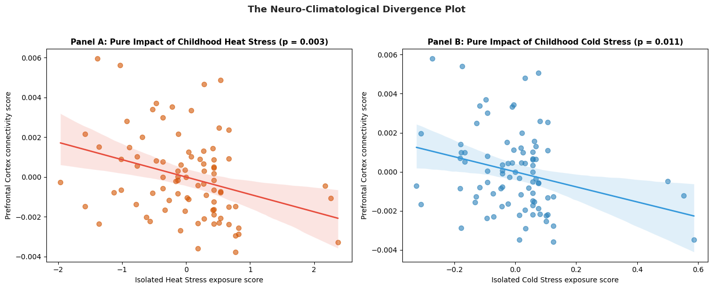
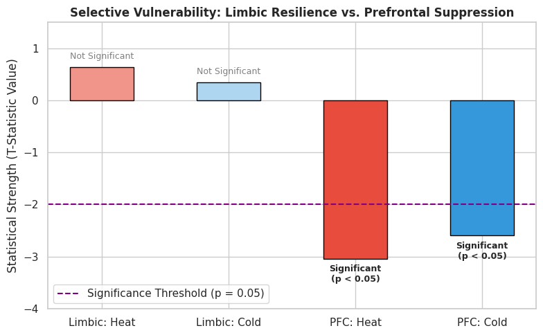
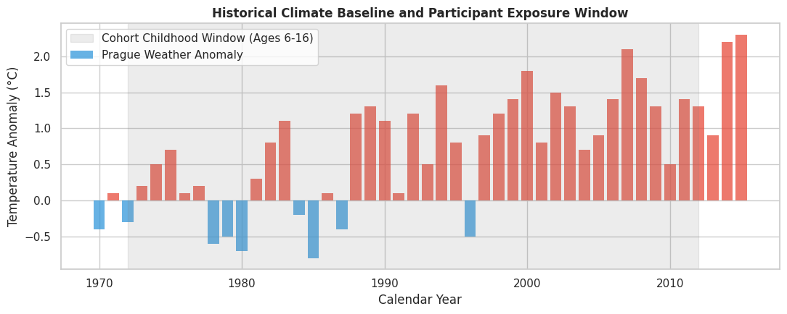
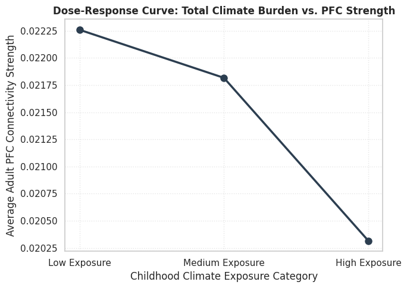

# Neuro-Climatology-childhood-climate-to-brain-connectivity-mapping
A climatology &amp; computational neuroscience model using dual-vector OLS regression to map historical weather anomalies onto high-resolution brain MRI matrices. Quantifies the long-term footprint of childhood extreme weather exposure, demonstrating selective structural connectivity suppression in the adult prefrontal cortex.

## The Purpose and Importance of the Project
Climate change and extreme weather events are typically addressed solely in terms of their impacts on the environment, ecosystems, or the economy. In contrast, the long-term effects of cumulative heat stress experienced during childhood (ages 6–16) on brain architecture and the quality of neural connections in adulthood represent a significant gap in environmental policy.

The aim of this project is to integrate historical official meteorological records with high-resolution clinical brain MRI scans using data science methods. The study aims to objectively measure the long-term biological effects of extreme weather stress in early life on the human prefrontal cortex—the center of reasoning, focus, and decision-making—and to reveal the direct neurological dimension of the climate crisis.

## Data Sets Used (Data Integration)
In this project, two independent datasets (both entirely official and fact-based) have been combined to ensure the reliability and accuracy of the analysis:
* *Clinical Brain Data (Prague Cohort):* The study utilized a high-resolution diffusion MRI (tractography) dataset from 86 adult participants. From these data, filtered according to the AAL-90 brain atlas boundaries, the structural connection strengths (connection matrices) of the Prefrontal Cortex and Limbic System networks were calculated for each participant.
* *Historical Climate Data (Prague-Klementinum):* The analysis is based on official annual temperature anomalies from a historic meteorological station that has maintained uninterrupted daily weather records since 1775. Using this dataset, historical weather fluctuations that precisely correspond to each participant’s childhood years (ages 6–16) were incorporated into the model.

## Methodology
To ensure the accuracy of the results obtained in this study and to remove external noise from the model, a three-step data processing and statistical workflow was established:
* *Critical Developmental Window (Ages 6–16):* To examine the periods of childhood and adolescence, during which the structural development of the human brain is most active, each participant’s historical climate exposure between the ages of 6 and 16 was isolated based on their year of birth.
* *Dual-Vector Cumulative Load:* Two separate variables were created to prevent years with extreme heat and extreme cold from mathematically canceling each other out in the analyses. Positive anomalies were entered into the model as "Childhood Heat Stress," while negative anomalies were entered as "Childhood Cold Stress" in absolute terms, as two separate environmental loads.
* *Statistical Control (OLS Regression):* The Ordinary Least Squares method was used to determine the net effect of environmental factors on the brain. All variables that could act as confounders (such as age, gender, and socioeconomic status) were included in the model as control variables, and their effects were eliminated.

## Key Findings & Visualizations
Statistical analyses have shown that exposure to extreme weather during childhood has a specific, regionally targeted effect on the adult brain, rather than a random one:
   * *Effect on the Prefrontal Cortex (PFC):* According to OLS regression results, cumulative heat waves during childhood ($p = 0.003$) and extremely cold winters ($p = 0.011$) linearly and persistently reduce prefrontal connectivity in adulthood. The model explains 14.6% of the variance in this region.
   * *Limbic System Resilience:* It has been established that neither heat stress nor cold stress caused significant structural damage in the limbic system network, which regulates emotional and survival processes ($p > 0.05$).

**Figure 1: Paired Partial Regression Analysis (The Neuro-Climatological Divergence Plot)**
After controlling for all confounding factors such as age, gender, and education, the pure negative effect of childhood heat and cold exposure on the frontal brain pathways was isolated.

**Figure 2: Mapping Selective Vulnerability**
This comparison, based on T-statistic values, demonstrates that environmental stress does not affect all parts of the brain randomly; while the limbic system remains resilient, the forebrain is selectively suppressed.

**Figure 3: The Retrospective Exposure Timeline**
The overlap between the historical Prague-Klementinum air quality records and the participants’ development windows demonstrates that the study is based on a consistent and logical natural experiment.

**Figure 4: Cumulative Degradation Curve (Structural Connectome Degradation Curve)**
When participants are grouped according to their total climate burden, this dose-response curve shows how the connectivity strength of the prefrontal cortex declines as environmental pressure increases from low to high.

